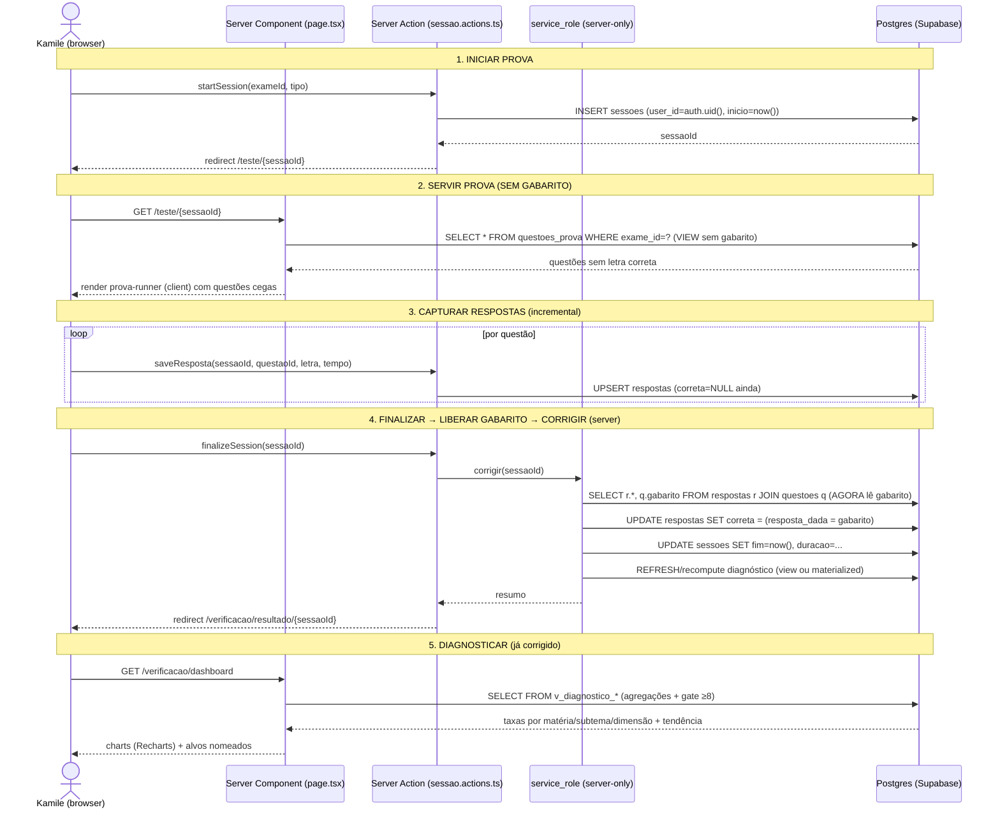

# Advoga — Fullstack Architecture Document

> **Autor:** Aria (@architect) · **Data:** 2026-06-21 · **Status:** v1.0 (FASE 0 / EP-0 Fundação)
> **Owner:** Marcos · **Usuária:** Kamile · **Restrição-mãe:** prova OAB 1ª fase **06/09/2026** (77 dias). Drop 1 usável em **dias**.
> **Fontes da verdade:** `the-brain/.../kamile-oab/01-BRIEF.md` (PRD — §8 é canônico p/ schema), `HANDOFF-AIOX.md`, `docs/00-ORION-PLAN.md`.
> **Modo de build:** LOCAL-FIRST (Supabase local via Docker + Next.js dev). Promoção pro cloud da Kamile só no deploy.

---

## 0. Princípios de arquitetura deste projeto (não negociáveis)

1. **O gabarito é segredo até o `finalize`.** A resposta correta NUNCA chega ao client antes da finalização da sessão. Isto é uma fronteira de segurança, não uma conveniência de UX (§3, §11).
2. **Anti-chute é estrutural.** Toda afirmação "você está fraca em X" passa por **gate de volume ≥ 8** antes de virar recomendação. Fato (estatística) e recomendação (texto) são camadas separadas (§4).
3. **Dimensões transversais são um conjunto ABERTO.** O motor de diagnóstico NUNCA hardcoda nomes de eixos. Adicionar um eixo = inserir linhas em `dimensoes`/`questao_tags`, sem recompilar nem migrar (§4, modelo EAV do §8.2 do brief).
4. **Local→cloud sem retrabalho.** Migrations idênticas; promover = trocar `.env` + `supabase db push`. Zero divergência schema (§6).
5. **Pragmatismo cirúrgico.** 77 dias. Nenhuma peça de infra entra se não acelerar o DoD do Drop 1. Sem Turborepo, sem microsserviços, sem fila — tudo que o Postgres + Next.js já resolvem fica no Postgres + Next.js.

---

## 1. Stack Confirmada

A stack abaixo é a **fonte única de verdade**. Todo `@dev` usa estas versões exatas.

| Categoria | Tecnologia | Versão | Propósito | Racional |
|---|---|---|---|---|
| Framework | **Next.js (App Router)** | **16.2.x** | App fullstack: RSC + Server Actions + Route Handlers | D-03. Atual estável (jun/2026); Turbopack default, React Compiler estável, RSC maduro. Server Actions resolvem o anti-vazamento de gabarito sem API REST separada. |
| Runtime | **Node.js** | **>= 20 LTS** | Exigência mínima do Next 16 | Trava o `engines` no `package.json`. |
| Linguagem | **TypeScript** | **5.6+** | Type safety end-to-end | Tipos compartilhados entre RSC, actions e client. |
| UI lib | **React** | **19.2** (canary via Next 16) | Componentes | Vem casado com Next 16; Server Components first. |
| Estilo | **Tailwind CSS** | **4.x** | Utility CSS | Casado com shadcn/ui. |
| Componentes | **shadcn/ui** | latest (copy-in) | Primitivos acessíveis (Radix) | Não é dependência npm versionada — código copiado pro repo. Dá controle total, zero lock-in, e **traz o módulo Charts**. |
| Charts | **Recharts** | **3.x** (via shadcn/ui Charts) | Dashboard: barras (acerto/matéria), linhas (evolução temporal), gauge (countdown/progresso) | Declarativo, SVG, **base oficial do shadcn Charts** (herda tokens de tema), amplamente entendido por LLMs — crítico p/ implementação por agentes. Tremor foi descartado (camada opinativa desnecessária); visx descartado (custo de código alto p/ 77 dias). |
| DB | **PostgreSQL** (Supabase) | **15** (Supabase local) | Banco relacional + views de diagnóstico | D-03. EAV de dimensões abertas + agregações SQL são o coração do motor. |
| Backend platform | **Supabase** | local (Docker) → cloud Kamile | DB + Auth + (futuro Storage) | D-03. Local-first no build; cloud da Kamile no deploy. |
| Cliente DB | **@supabase/ssr** | **0.5+** | Cliente Supabase p/ App Router (server + browser, cookie-based) | Pacote **oficial atual** (auth-helpers está deprecado). Suporta RSC, Route Handlers, middleware. |
| Cliente DB (low-level) | **@supabase/supabase-js** | **2.x** | Peer do ssr | Query builder. |
| Estado client | **Zustand** | **5.x** | Estado efêmero do Ambiente de Teste (respostas em andamento, timer) | Leve. Só onde RSC não alcança (estado interativo do simulado). Server state mora no servidor. |
| Data fetching client | **@tanstack/react-query** | **5.x** | Cache/mutations no client p/ telas interativas (Consulta, refazer diagnóstico) | Opcional no Drop 1 (RSC cobre o read inicial). Entra onde houver refetch interativo. |
| Validação | **Zod** | **3.x** | Schemas de input das Server Actions + parsing de PDF→questão | Valida na fronteira server. |
| Testes unit | **Vitest** | **2.x** | Lógica pura: weakness score, planner, parser | Rápido, ESM-native. |
| Testes E2E | **Playwright** | **1.4x** | Fluxo de prova ponta-a-ponta (DoD Drop 1) + **teste anti-vazamento de gabarito** | Já é MCP do projeto. Valida que o gabarito não está no payload antes do finalize. |
| Deploy frontend | **Vercel** | — | Host do Next.js | D-03. |
| CI/CD | **GitHub Actions** | — | lint + typecheck + test em PR | Mínimo. Deploy via integração Vercel. |
| Gerência de pacote | **pnpm** | **9.x** | Install determinístico | Lockfile rápido. |

### Decisão crítica: supabase-js no server (RSC/Actions) vs client

| Contexto | Cliente | Chave usada | Regra |
|---|---|---|---|
| **RSC (Server Components)** | `createServerClient` (`@supabase/ssr`), cookies read-only | `anon` (RLS aplica) | Leitura inicial de telas. **Pode ler tudo que a RLS permite — mas NUNCA seleciona `questoes.gabarito` em fluxo de prova ativa.** Usa a view `questoes_prova` (§3). |
| **Server Action / Route Handler** | `createServerClient`, cookies read+write | `anon` p/ ops do usuário; **`service_role` SOMENTE** no `finalizeSession` e no pipeline de ingestão | Escrita de respostas, finalize+correção, geração de plano. O `service_role` fica **exclusivamente server-side** (nunca exposto a `NEXT_PUBLIC_*`). |
| **Client Component** | `createBrowserClient` (`@supabase/ssr`) | `anon` (RLS aplica) | Apenas telas que precisam de interatividade reativa (Consulta/busca, toggles do dashboard). **Nunca toca correção nem gabarito.** |
| **Middleware** | `createServerClient` (refresh de token) | `anon` | Mantém sessão viva. Single-user, mas o padrão é o oficial. |

> **AUTH — simplificação single-user (D-03):** não há signup/multi-conta. Uma conta da Kamile é provisionada (seed/manual no Supabase dela). `@supabase/ssr` + middleware mantêm a sessão; RLS filtra por `auth.uid()`. Login = uma tela mínima (ou magic link). Sem reset de senha, sem roles. Isto reduz drasticamente a superfície e cabe nos 77 dias.

---

## 2. Estrutura de Pastas (App Router) → 4 Ambientes

**Repo single-app** (não monorepo). Turborepo/workspaces seriam cerimônia sem payoff para um app single-user com prazo curto. Tipos compartilhados vivem em `src/lib/types` (importados por server e client — mesmo runtime).

Os **4 ambientes da Kamile** (Teste · Estudo · Consulta · Verificação) mapeiam para **4 route groups** sob um layout único com navegação desktop-first.

```
advoga/
├── src/
│   ├── app/
│   │   ├── layout.tsx                  # Root layout (fonts, providers, theme shadcn)
│   │   ├── globals.css                 # Tailwind v4 + tokens shadcn
│   │   ├── page.tsx                     # Home/cockpit pessoal: countdown + atalhos p/ 4 ambientes
│   │   ├── login/
│   │   │   └── page.tsx                 # Login mínimo single-user (magic link / senha)
│   │   │
│   │   ├── (teste)/                      # ░░ AMBIENTE: TESTE ░░  (serve prova SEM gabarito + timer)
│   │   │   ├── layout.tsx               # Layout "foco": sem distração, timer fixo no topo
│   │   │   ├── teste/
│   │   │   │   ├── page.tsx             # [RSC] Lista de provas/simulados disponíveis p/ iniciar
│   │   │   │   └── [sessaoId]/
│   │   │   │       ├── page.tsx         # [RSC] Carrega questões via view SEM gabarito (server)
│   │   │   │       └── prova-runner.tsx # [client] Navegação entre questões, captura resposta, timer (Zustand)
│   │   │   └── _actions/
│   │   │       └── sessao.actions.ts    # 'use server' — startSession, saveResposta, finalizeSession(+correção)
│   │   │
│   │   ├── (estudo)/                     # ░░ AMBIENTE: ESTUDO ░░  (planner + reforço focado)
│   │   │   ├── layout.tsx
│   │   │   ├── plano/
│   │   │   │   ├── page.tsx             # [RSC] Plano do dia: horas→questões, nós-alvo, dose de Ética
│   │   │   │   └── plano-controls.tsx   # [client] Ajusta horas disponíveis → re-gera plano (action)
│   │   │   ├── treino/
│   │   │   │   └── [origem]/page.tsx    # [RSC] Sessão de treino gerada pelo planner (vira sessão tipo 'treino')
│   │   │   └── _actions/
│   │   │       └── planner.actions.ts   # 'use server' — gerarPlanoDiario(horas), iniciarTreinoDoNo(noId)
│   │   │
│   │   ├── (consulta)/                   # ░░ AMBIENTE: CONSULTA ░░  (legislação + banco pesquisável)
│   │   │   ├── layout.tsx               # Responsivo (mobile-friendly — consulta rápida no celular)
│   │   │   ├── legislacao/
│   │   │   │   └── page.tsx             # [RSC/client] Busca em leis (Drop 3; Drop 1 = stub/links Planalto)
│   │   │   └── questoes/
│   │   │       ├── page.tsx             # [client] Busca/filtro no banco de questões (com gabarito — modo estudo, NÃO prova)
│   │   │       └── [questaoId]/page.tsx # [RSC] Detalhe da questão + gabarito + tags
│   │   │
│   │   ├── (verificacao)/                # ░░ AMBIENTE: VERIFICAÇÃO ░░  (correção + diagnóstico + dashboard)
│   │   │   ├── layout.tsx
│   │   │   ├── dashboard/
│   │   │   │   ├── page.tsx             # [RSC] Lê views de diagnóstico; passa dados p/ charts
│   │   │   │   ├── grafico-materias.tsx # [client] Recharts: acerto por matéria/subtema
│   │   │   │   ├── grafico-evolucao.tsx # [client] Recharts: série temporal (tendência)
│   │   │   │   └── countdown.tsx        # [client] Dias até 06/09/2026
│   │   │   └── resultado/
│   │   │       └── [sessaoId]/
│   │   │           └── page.tsx         # [RSC] Pós-finalize: acertos/erros por matéria+subtema + gabarito liberado
│   │   │
│   │   └── api/                          # Route Handlers (só onde Server Action não cabe)
│   │       └── health/route.ts          # Healthcheck (deploy)
│   │
│   ├── lib/
│   │   ├── supabase/
│   │   │   ├── server.ts                # createServerClient (RSC: read-only cookies)
│   │   │   ├── action.ts                # createServerClient p/ Server Actions (read+write cookies)
│   │   │   ├── service.ts               # client service_role — SOMENTE server, p/ finalize + ingestão
│   │   │   ├── client.ts                # createBrowserClient
│   │   │   └── middleware.ts            # helper de refresh de sessão
│   │   ├── types/
│   │   │   ├── db.types.ts              # Tipos gerados do schema (supabase gen types)
│   │   │   └── domain.ts                # Tipos de domínio (Questao, Resposta, Diagnostico, PlanoDiario, NoEixo)
│   │   ├── diagnostico/
│   │   │   ├── weakness-score.ts        # f(1−taxa, confiança_volume, peso_incidência) — PURO, testável
│   │   │   ├── volume-gate.ts           # gate ≥8 (constante calibrável)
│   │   │   └── queries.ts               # wrappers tipados das views genéricas (qualquer eixo/dimensão)
│   │   ├── planner/
│   │   │   ├── planner.ts               # horas→questões, incidência×weakness, espaçada, dose Ética — PURO
│   │   │   └── config.ts                # defaults calibráveis (q/h=30, peso Ética, gate=8)
│   │   ├── correcao/
│   │   │   └── corrigir.ts              # compara resposta×gabarito (roda no finalize, server)
│   │   └── utils.ts
│   │
│   ├── components/
│   │   ├── ui/                          # shadcn/ui (copy-in: button, card, chart, table, dialog...)
│   │   └── shared/                      # Nav dos 4 ambientes, AppShell desktop-first
│   │
│   └── middleware.ts                    # Refresh de sessão Supabase (usa lib/supabase/middleware)
│
├── supabase/
│   ├── config.toml                      # Config do Supabase local (Docker)
│   ├── migrations/                      # DDL idêntico local↔cloud (escrito pelo @data-engineer)
│   │   ├── 0001_core_schema.sql         # materias, subtemas, micro_topicos, exames, questoes
│   │   ├── 0002_dimensoes_eav.sql       # dimensoes, dimensao_valores, questao_tags
│   │   ├── 0003_sessoes_respostas.sql   # sessoes, respostas
│   │   ├── 0004_views_diagnostico.sql   # views genéricas de agregação (§4)
│   │   ├── 0005_rls_single_user.sql     # RLS por auth.uid()
│   │   └── 0006_view_prova_sem_gabarito.sql  # view questoes_prova (§3)
│   └── seed.sql                         # taxonomia semente (legal-chief) + conta Kamile
│
├── tests/
│   ├── unit/                            # weakness-score, planner, parser (Vitest)
│   └── e2e/
│       ├── fluxo-prova.spec.ts          # DoD Drop 1 ponta-a-ponta
│       └── gabarito-nao-vaza.spec.ts    # SEGURANÇA: assert gabarito ausente no payload pré-finalize
│
├── .env                                 # local (gitignored): aponta p/ Supabase LOCAL
├── .env.example                         # template (já existe)
├── next.config.ts
├── tailwind.config.ts
├── components.json                      # config shadcn/ui
├── package.json                         # engines.node >=20; pnpm
└── docs/                                # (este doc, PRD, SCHEMA.md do data-engineer)
```

### Server Components vs Client Components — regra de ouro

- **RSC por padrão** (todo `page.tsx` é server). Faz fetch via `lib/supabase/server.ts`, aplica RLS, e — em fluxo de prova — usa a **view sem gabarito**.
- **Client Components (`'use client'`) só para interatividade:** `prova-runner` (timer + navegação + estado de respostas via Zustand), gráficos Recharts, controles do planner, busca da Consulta.
- **Mutações = Server Actions** (`_actions/*.ts` com `'use server'`). Nada de chamar Supabase de escrita direto do client em fluxos sensíveis (start/save/finalize). Isto mantém a lógica de correção e o `service_role` fora do bundle do browser.

---

## 3. Fluxo de Dados do Core — "servir prova → capturar → finalizar → liberar gabarito → corrigir → diagnosticar"

Este é o coração do Drop 1 e o ponto de segurança nº 1: **o gabarito não pode vazar antes do finalize.**

### Mecanismo anti-vazamento (defense in depth, 3 camadas)

1. **Camada de dados (SQL):** uma view `questoes_prova` projeta as questões **SEM as colunas `gabarito`, `validade_motivo`** (e sem nada que entregue a resposta). O fluxo de prova lê SÓ desta view.
2. **Camada de aplicação (RSC/Action):** o `page.tsx` da prova e a action `saveResposta` jamais selecionam `questoes.gabarito`. A correção só acontece dentro de `finalizeSession` (server), depois que todas as respostas estão persistidas.
3. **Camada de teste (E2E):** `gabarito-nao-vaza.spec.ts` inspeciona o payload/HTML da prova ativa e **falha o build** se a letra correta aparecer antes do finalize.

> Opcional de reforço (Drop 2+, decisão do @data-engineer): RLS/`GRANT` que negue `SELECT` na coluna `gabarito` para o role do usuário durante sessão ativa. No Drop 1, a view + disciplina de query já fecham o vetor principal. Ver pedido D-1 ao data-engineer.

### Sequência (onde mora cada parte)



**Resumo de responsabilidades:**

| Parte | Onde | Cliente/role |
|---|---|---|
| Iniciar sessão | Server Action `startSession` | anon + RLS |
| Servir prova sem gabarito | RSC `page.tsx` lendo **view `questoes_prova`** | anon + RLS |
| Capturar respostas | Server Action `saveResposta` (estado vivo no client via Zustand, persist incremental) | anon + RLS |
| Finalizar + corrigir | Server Action `finalizeSession` → `corrigir.ts` | **service_role (server-only)** |
| Liberar gabarito | Só após finalize: telas `/resultado` e `/consulta/questoes` | anon + RLS (view completa) |
| Diagnosticar | RSC lendo views `v_diagnostico_*` | anon + RLS |

---

## 4. Motor de Diagnóstico — agregação genérica sobre eixos ABERTOS

### Princípio: uma query, qualquer eixo

O brief (§8.1, D-06) exige dimensões transversais como **conjunto aberto** (modelo EAV: `dimensoes`/`dimensao_valores`/`questao_tags`). A consequência arquitetural: **o motor não pode ter uma view por dimensão**. Ele tem **um conjunto pequeno de views genéricas** que agregam `respostas ⨝ questao_tags` por `dimensao_id` + `valor`, mais views fixas para o eixo de conteúdo (matéria/subtema/micro, que são colunas diretas em `questoes`).

Onde mora: **SQL views** (não app). Razão: a agregação é set-based, roda perto do dado, é trivialmente reutilizável por qualquer tela, e o volume (single-user, ~milhares de questões, ~milhares de respostas) é pequeno — **views normais bastam no Drop 1**; materialized view só se o dashboard ficar lento (improvável nesta escala). O **weakness score** e o **gate** vivem em parte na view (campos brutos: `n_feitas`, `n_acertos`, `taxa`, flag de volume) e em parte no app (`lib/diagnostico/weakness-score.ts`) para manter os pesos calibráveis sem migration.

### View 1 — eixo de conteúdo (matéria / subtema / micro)

```sql
-- v_diagnostico_conteudo: taxa por nó hierárquico do conteúdo, p/ a usuária corrente
CREATE VIEW v_diagnostico_conteudo AS
SELECT
  r_user.user_id,
  'subtema'::text                AS eixo,
  q.subtema_id                   AS no_id,
  st.nome                        AS no_nome,
  m.questoes_por_prova           AS peso_incidencia,   -- p/ ponderar (incidência FGV)
  count(*)                       AS n_feitas,
  count(*) FILTER (WHERE r.correta) AS n_acertos,
  round(avg((r.correta)::int)::numeric, 4) AS taxa,
  (count(*) >= 8)                AS volume_ok          -- GATE ≥8 (constante alinhada a config.ts)
FROM respostas r
JOIN (SELECT s.id, s.user_id FROM sessoes s) r_user ON r_user.id = r.sessao_id
JOIN questoes q  ON q.id = r.questao_id
JOIN subtemas st ON st.id = q.subtema_id
JOIN materias m  ON m.id = q.materia_id
WHERE r.correta IS NOT NULL          -- só sessões já finalizadas/corrigidas
GROUP BY r_user.user_id, q.subtema_id, st.nome, m.questoes_por_prova;
-- (views análogas/UNION p/ eixo='materia' e eixo='micro'; mesma forma)
```

### View 2 — dimensões transversais ABERTAS (a chave do EAV)

```sql
-- v_diagnostico_dimensao: taxa por (dimensão, valor) SEM hardcodar quais dimensões existem.
-- Adicionar um eixo novo = inserir em dimensoes/questao_tags. ZERO mudança aqui.
CREATE VIEW v_diagnostico_dimensao AS
SELECT
  r_user.user_id,
  d.chave                        AS dimensao_chave,    -- ex.: 'estilo_cognitivo', 'comando_negativo'
  d.nome                         AS dimensao_nome,
  coalesce(dv.valor, qt.valor_bool::text, qt.valor_num::text) AS valor,
  count(*)                       AS n_feitas,
  count(*) FILTER (WHERE r.correta) AS n_acertos,
  round(avg((r.correta)::int)::numeric, 4) AS taxa,
  (count(*) >= 8)                AS volume_ok
FROM respostas r
JOIN (SELECT s.id, s.user_id FROM sessoes s) r_user ON r_user.id = r.sessao_id
JOIN questao_tags qt ON qt.questao_id = r.questao_id
JOIN dimensoes d     ON d.id = qt.dimensao_id
LEFT JOIN dimensao_valores dv ON dv.id = qt.valor_id
WHERE r.correta IS NOT NULL
GROUP BY r_user.user_id, d.chave, d.nome,
         coalesce(dv.valor, qt.valor_bool::text, qt.valor_num::text);
```

### View 3 — CROSS-AXIS (subtema × dimensão) — "a mágica"

O insight verbatim da Kamile: *"erra Posse quando é caso-concreto; acerta a letra de lei."* Isto é o produto cartesiano subtema × (dimensão,valor), também **genérico sobre o conjunto aberto**.

```sql
-- v_diagnostico_cross: taxa por (subtema × dimensão×valor). Genérica p/ QUALQUER dimensão.
CREATE VIEW v_diagnostico_cross AS
SELECT
  r_user.user_id,
  q.subtema_id, st.nome AS subtema_nome,
  d.chave AS dimensao_chave,
  coalesce(dv.valor, qt.valor_bool::text, qt.valor_num::text) AS valor,
  count(*) AS n_feitas,
  count(*) FILTER (WHERE r.correta) AS n_acertos,
  round(avg((r.correta)::int)::numeric, 4) AS taxa,
  (count(*) >= 8) AS volume_ok
FROM respostas r
JOIN (SELECT s.id, s.user_id FROM sessoes s) r_user ON r_user.id = r.sessao_id
JOIN questoes q       ON q.id = r.questao_id
JOIN subtemas st      ON st.id = q.subtema_id
JOIN questao_tags qt  ON qt.questao_id = r.questao_id
JOIN dimensoes d      ON d.id = qt.dimensao_id
LEFT JOIN dimensao_valores dv ON dv.id = qt.valor_id
WHERE r.correta IS NOT NULL
GROUP BY r_user.user_id, q.subtema_id, st.nome, d.chave,
         coalesce(dv.valor, qt.valor_bool::text, qt.valor_num::text);
```

### Weakness score + gate (no app, calibrável)

```typescript
// lib/diagnostico/weakness-score.ts  (PURO — testável sem DB)
// nó vira ALVO só se volume_ok (gate ≥8). Abaixo disso: "amostra insuficiente".
export function weaknessScore(no: NoDiagnostico, cfg = DEFAULTS): number | null {
  if (no.n_feitas < cfg.gateVolume) return null;            // GATE ≥8 → não declara fraqueza
  const erro      = 1 - no.taxa;                            // (1 − taxa de acerto)
  const confianca = Math.min(1, no.n_feitas / cfg.volumeConfiancaPlena); // confiança_de_volume
  const incid     = no.peso_incidencia / cfg.incidenciaMax; // peso de incidência FGV normalizado
  return erro * confianca * incid * 100;                    // ordena alvos; nomeados explicitamente
}
```

O gate aparece **duas vezes** (defense in depth contra chute): na view (`volume_ok`) e no app (`weaknessScore` retorna `null`). Isto satisfaz o §4 do brief: estatística é fato; "estude X" é recomendação rotulada e rastreável ao dado.

> **Discovery Engine (§8.5 — EP-2):** roda sobre as mesmas views. "Correlação" = ranquear `dimensao_chave` por (1−taxa) nas questões que ela errou (lê `v_diagnostico_dimensao`). "Mineração LLM" = job offline que lê questões erradas e propõe novas linhas em `dimensoes` → re-tag → re-roda views. Por ser EAV genérico, **uma dimensão nova entra sem tocar em código nem view**. Esta é a razão arquitetural de o motor ser genérico desde o Drop 1, mesmo que a UI cross-axis só apareça no Drop 2.

---

## 5. Planner v1 — horas → questões

Lógica **pura** em `lib/planner/planner.ts` (testável), exposta via Server Action `gerarPlanoDiario(horas)`. Persiste em `plano_diario` (`distribuicao_json`).

```
ENTRADA: horas_disponiveis (Kamile informa no Estudo)
1. questoes_alvo = horas * QPH            // QPH default 30 (lib/planner/config.ts, calibrável)
2. Para cada nó candidato (matéria/subtema), prioridade =
       incidencia_FGV(materia) * weaknessScore(no)   // incidência × fraqueza (não só fraqueza)
   - nós sem volume_ok entram como "MEDIR" (amostragem), não como "reforço"
3. Injeta REPETIÇÃO ESPAÇADA: micro-tópicos errados nas últimas N sessões
   reaparecem em janelas crescentes (1d, 3d, 7d).
4. Garante DOSE DE ÉTICA: piso fixo de questões de Ética por dia (alto ROI — 8q fixas, conteúdo fechado).
5. Distribui questoes_alvo proporcional às prioridades normalizadas, respeitando o piso de Ética.
SAÍDA: { questoes_alvo, distribuicao: [{materia, subtema?, dimensao?, n, motivo}], gerado_em }
       ex.: "Hoje (3h): 90 questões — 25 Ética, 20 Proc.Penal/Recursos, 15 Posse(caso-concreto)…"
```

Defaults calibráveis (sem migration): `QPH=30`, `gateVolume=8`, `pisoEtica`, janelas de espaçamento, peso de incidência. Item aberto §13.5 do brief (velocidade real) só ajusta `QPH`.

---

## 6. Local-first → Cloud (mesmas migrations, troca de `.env`)

A estratégia do Orion: **build 100% local, cloud só no deploy, zero retrabalho de schema.**

### Como o `.env` alterna

```bash
# .env  (LOCAL — durante todo o build; gitignored)
NEXT_PUBLIC_SUPABASE_URL=http://127.0.0.1:54321          # supabase start (Docker local)
NEXT_PUBLIC_SUPABASE_ANON_KEY=<anon-local-do-supabase-start>
SUPABASE_SERVICE_ROLE_KEY=<service-role-local>            # server-only, NUNCA NEXT_PUBLIC

# .env  (CLOUD — no deploy; preenchido com as keys DA KAMILE; nunca commitado)
NEXT_PUBLIC_SUPABASE_URL=https://<project-ref-kamile>.supabase.co
NEXT_PUBLIC_SUPABASE_ANON_KEY=<anon-da-kamile>
SUPABASE_SERVICE_ROLE_KEY=<service-role-da-kamile>        # só em Vercel env vars (server)
```

- O código lê **sempre as mesmas variáveis** (via `lib/supabase/*`). Trocar de ambiente = trocar valores no `.env` (local) ou nas **Vercel Environment Variables** (cloud). Nenhuma branch de código por ambiente.
- **Regra de segurança (D-03):** `service_role` JAMAIS recebe prefixo `NEXT_PUBLIC_`. Ele só existe no servidor (Server Actions/ingestão) e nas env vars server da Vercel. `.env` é gitignored (já está no `.gitignore`).

### Migrations idênticas

```bash
# LOCAL
supabase start                 # sobe Postgres+Auth no Docker
supabase db reset              # aplica migrations/*.sql + seed.sql
supabase gen types typescript --local > src/lib/types/db.types.ts

# PROMOÇÃO PRO CLOUD (no deploy, quando owner libera keys da Kamile)
supabase link --project-ref <ref-kamile>
supabase db push               # aplica as MESMAS migrations no projeto da Kamile
```

### O que muda no deploy (e só isso)

| Item | Local | Cloud (deploy) |
|---|---|---|
| Supabase URL/keys | `supabase start` (Docker) | projeto **da Kamile** (`.env` → Vercel env vars) |
| Host do Next.js | `next dev` | **Vercel** (build + edge) |
| Migrations | `supabase db reset` | `supabase db push` (idênticas) |
| `service_role` | `.env` local | Vercel env var (server scope) |
| Seed (taxonomia + conta Kamile) | `seed.sql` | rodar uma vez no projeto da Kamile |
| CI | — | GitHub Actions: lint+typecheck+test no PR |

> **Quem aperta o botão:** deploy/push é EXCLUSIVO do @devops (Gage). Aria só desenha. As keys da Kamile entram pelo cockpit `docs/setup/deploy-credentials.html` no início da Fase 1/deploy.

---

## 7. Pedidos explícitos ao @data-engineer (Dara)

O schema do **§8.2 do brief é canônico** — eu não o redefino. Abaixo, os ajustes que o motor de diagnóstico, o anti-vazamento e o planner exigem do DDL/migrations:

- **D-1 (CRÍTICO — segurança):** criar a view **`questoes_prova`** = `questoes` projetada **SEM** `gabarito` e `validade_motivo` (e qualquer coluna que entregue a resposta). É a única fonte de leitura do Ambiente de Teste. Avaliar (Drop 2+) `REVOKE SELECT (gabarito) ... FROM authenticated` durante sessão ativa como reforço opcional.
- **D-2 (motor genérico):** criar as **3 views de diagnóstico** do §4 — `v_diagnostico_conteudo` (matéria/subtema/micro), `v_diagnostico_dimensao` (EAV genérico), `v_diagnostico_cross` (subtema×dimensão). Todas filtram `r.correta IS NOT NULL` e expõem `n_feitas, n_acertos, taxa, volume_ok (>=8), peso_incidencia`. **Não criar uma view por dimensão** — genéricas sobre `questao_tags`.
- **D-3 (índices p/ as agregações):** `respostas(sessao_id)`, `respostas(questao_id)`, `sessoes(user_id)`, `questao_tags(questao_id)`, `questao_tags(dimensao_id, valor_id)`, `questoes(materia_id)`, `questoes(subtema_id)`. São os joins quentes das views.
- **D-4 (EAV bem-formado):** em `questao_tags`, garantir **CHECK** de que exatamente um de `valor_id | valor_num | valor_bool` está preenchido (conforme `dimensoes.tipo`), e índice/único em `(questao_id, dimensao_id, valor_id)` p/ evitar tag duplicada. `dimensoes.chave` UNIQUE (é a chave estável usada pelo motor e pelo Discovery).
- **D-5 (correção atômica):** `finalizeSession` precisa de uma operação server-side que escreva `respostas.correta = (resposta_dada = gabarito)` em lote + `sessoes.fim/duracao`. Preferir **função SQL (`rpc`) `corrigir_sessao(sessao_id)`** transacional (mais robusto e testável que N updates do app). Idempotente (re-finalizar não corrompe).
- **D-6 (RLS single-user):** todas as tabelas com `user_id` (`sessoes`, `respostas`, `plano_diario`, `diagnostico` se materializado) filtram por `auth.uid()`. Catálogo (`materias`, `subtemas`, `micro_topicos`, `exames`, `questoes`, `dimensoes`, `dimensao_valores`, `questao_tags`) = **leitura para `authenticated`**; escrita só `service_role` (ingestão). As views herdam a RLS das tabelas-base (`security_invoker`).
- **D-7 (gate calibrável):** o `>= 8` aparece nas views como `volume_ok`. Manter como **valor único e documentado** no DDL, espelhando `lib/planner/config.ts:gateVolume`. Se virar parâmetro, expor via função.
- **D-8 (anuladas, Drop 1):** `questoes.validade_status` aceita `anulada`; questões anuladas pelo gabarito definitivo **não contam** no denominador das views (`WHERE validade_status <> 'anulada'` ou tratamento equivalente) — anti-chute exige não punir a Kamile por questão anulada.
- **D-9 (tipos):** após cada migration, rodar `supabase gen types typescript` → `src/lib/types/db.types.ts` (mantém o front tipado e detecta drift).

---

## 8. Cross-cutting (resumo)

- **Segurança:** segredo só em `.env` (gitignored); `service_role` server-only; gabarito atrás de view + disciplina de query + teste E2E; RLS por `auth.uid()`; input das Server Actions validado com Zod. Sem PII além das respostas da Kamile (dados dela, conta dela — D-03).
- **Performance:** escala single-user, milhares de questões/respostas → views normais bastam; `materialized` só se medirmos lentidão. RSC + cache do Next p/ catálogo (questões mudam raro). Bundle enxuto (sem Tremor/Nivo).
- **Erros:** Server Actions retornam `{ ok, error? }` tipado; correção é transacional (rpc) e idempotente; parser de PDF valida com Zod e falha alto na ingestão (melhor recusar questão que ingerir lixo).
- **Testes (prioridade Drop 1):** (1) `gabarito-nao-vaza.spec.ts` — segurança; (2) `fluxo-prova.spec.ts` — DoD ponta-a-ponta; (3) unit de `weakness-score`, `planner`, parser. QA valida correção contra gabarito com dados sintéticos (HANDOFF §5/1.5).
- **Observabilidade:** Drop 1 mínimo — logs server nas actions + healthcheck. Sentry/analytics ficam pós-prova (parking).

---

## Change Log

| Data | Versão | Descrição | Autor |
|---|---|---|---|
| 2026-06-21 | v1.0 | Arquitetura full-stack inicial dos 4 ambientes; stack confirmada (Next 16 + Supabase + Recharts/shadcn); fluxo anti-vazamento de gabarito (view + action + E2E); motor de diagnóstico genérico sobre EAV (3 views); planner v1; estratégia local→cloud; 9 pedidos ao @data-engineer. | Aria (@architect) |
